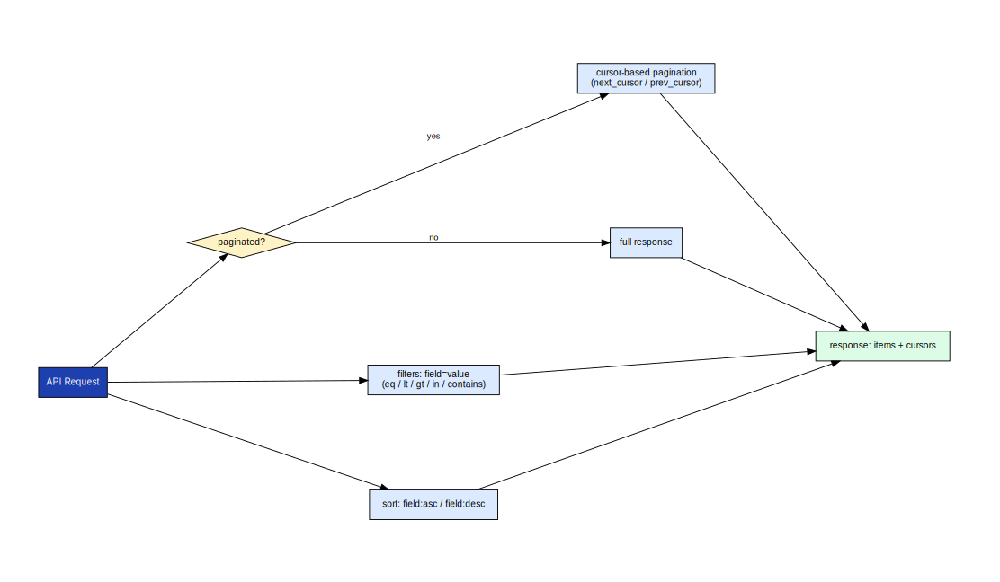

# axme-sdk-dotnet

**Official .NET SDK for the AXME platform.** Send and manage intents, observe lifecycle events, handle approvals, and access the enterprise admin surface — async/await throughout, targeting .NET 6+.

> **Alpha** · API surface is stabilizing. Not recommended for production workloads yet.  
> Alpha access: https://cloud.axme.ai/alpha · Contact and suggestions: [hello@axme.ai](mailto:hello@axme.ai)

---

## What Is AXME?

AXME is a coordination infrastructure for durable execution of long-running intents across distributed systems.

It provides a model for executing **intents** — requests that may take minutes, hours, or longer to complete — across services, agents, and human participants.

## AXP — the Intent Protocol

At the core of AXME is **AXP (Intent Protocol)** — an open protocol that defines contracts and lifecycle rules for intent processing.

AXP can be implemented independently.  
The open part of the platform includes:

- the protocol specification and schemas
- SDKs and CLI for integration
- conformance tests
- implementation and integration documentation

## AXME Cloud

**AXME Cloud** is the managed service that runs AXP in production together with **The Registry** (identity and routing).

It removes operational complexity by providing:

- reliable intent delivery and retries  
- lifecycle management for long-running operations  
- handling of timeouts, waits, reminders, and escalation  
- observability of intent status and execution history  

State and events can be accessed through:

- API and SDKs  
- event streams and webhooks  
- the cloud console

---

## What You Can Do With This SDK

- **Send intents** — create typed, durable actions with delivery guarantees
- **Observe lifecycle** — stream real-time state events
- **Approve or reject** — handle human-in-the-loop steps from .NET services
- **Control workflows** — pause, resume, cancel, update retry policies and reminders
- **Administer** — manage organizations, workspaces, service accounts, and grants

---

## Install

```bash
dotnet add package Axme
```

---

## Quickstart

```csharp
using System.Text.Json.Nodes;
using Axme.Sdk;

var client = new AxmeClient(new AxmeClientConfig
{
    ApiKey = "AXME_API_KEY", // sent as x-api-key
    ActorToken = "OPTIONAL_USER_OR_SESSION_TOKEN", // sent as Authorization: Bearer
    // Optional override (defaults to https://api.cloud.axme.ai):
    // BaseUrl = "https://staging-api.cloud.axme.ai",
});

// Check connectivity
Console.WriteLine(await client.HealthAsync());

// Send an intent
var intent = await client.CreateIntentAsync(
    new JsonObject
    {
        ["intent_type"] = "order.fulfillment.v1",
        ["payload"] = new JsonObject
        {
            ["order_id"] = "ord_123",
            ["priority"] = "high",
        },
        ["owner_agent"] = "agent://fulfillment-service",
    },
    new RequestOptions { IdempotencyKey = "fulfill-ord-123-001" }
);
Console.WriteLine($"{intent["intent_id"]} {intent["status"]}");
```

---

## Minimal Language-Native Example

Short basic submit/get example:

- [`examples/BasicSubmit.cs`](examples/BasicSubmit.cs)

Run:

```bash
export AXME_API_KEY="axme_sa_..."
# use examples/BasicSubmit.cs inside your app project (or script host)
```

Full runnable scenario set lives in:

- Cloud: <https://github.com/AxmeAI/axme-examples/tree/main/cloud>
- Protocol-only: <https://github.com/AxmeAI/axme-examples/tree/main/protocol>

---

## API Method Families

The SDK covers the full public API surface:


*`4xx` client errors throw `AxmeClientException` — do not retry. `5xx` server errors throw `AxmeServerException` — safe to retry with the original idempotency key. The `RetryAfter` property provides the wait hint.*

---

## Pagination, Filtering, and Sorting

```csharp
// Paginate through pending intents
var page = await client.ListIntentsAsync(
    new JsonObject { ["status"] = "PENDING", ["limit"] = 20 }
);

while (page["cursor"] != null)
{
    page = await client.ListIntentsAsync(
        new JsonObject { ["after"] = page["cursor"]!.GetValue<string>(), ["limit"] = 20 }
    );
}
```



*All list methods return a `cursor` field. Pass it as `after` in subsequent calls. The SDK does not buffer pages — you control the iteration.*

---

## Approvals

```csharp
var inbox = await client.ListInboxAsync(
    new JsonObject { ["owner_agent"] = "agent://manager", ["status"] = "PENDING" }
);

foreach (var item in inbox["items"]!.AsArray())
{
    await client.ResolveApprovalAsync(
        item!["intent_id"]!.GetValue<string>(),
        new JsonObject { ["decision"] = "approved", ["note"] = "Reviewed and approved" },
        new RequestOptions()
    );
}
```

---

## Enterprise Admin APIs

The .NET SDK includes the full service-account lifecycle surface:

```csharp
// Create a service account
var sa = await client.CreateServiceAccountAsync(
    new JsonObject { ["name"] = "ci-runner", ["org_id"] = "org_abc" },
    new RequestOptions { IdempotencyKey = "sa-ci-runner-001" }
);

// Issue a key
var key = await client.CreateServiceAccountKeyAsync(
    sa["id"]!.GetValue<string>(),
    new RequestOptions()
);

// List service accounts
var list = await client.ListServiceAccountsAsync("org_abc");

// Revoke a key
await client.RevokeServiceAccountKeyAsync(
    sa["id"]!.GetValue<string>(),
    key["key_id"]!.GetValue<string>()
);
```

Available methods:
- `CreateServiceAccountAsync` / `ListServiceAccountsAsync` / `GetServiceAccountAsync`
- `CreateServiceAccountKeyAsync` / `RevokeServiceAccountKeyAsync`

---

## Nick and Identity Registry

```csharp
var registered = await client.RegisterNickAsync(
    new JsonObject { ["nick"] = "@partner.user", ["display_name"] = "Partner User" },
    new RequestOptions { IdempotencyKey = "nick-register-001" }
);

var check = await client.CheckNickAsync("@partner.user");

var renamed = await client.RenameNickAsync(
    new JsonObject
    {
        ["owner_agent"] = registered["owner_agent"]!.GetValue<string>(),
        ["nick"] = "@partner.new",
    },
    new RequestOptions { IdempotencyKey = "nick-rename-001" }
);

var profile = await client.GetUserProfileAsync(
    registered["owner_agent"]!.GetValue<string>()
);
```

---

## Repository Structure

```
axme-sdk-dotnet/
├── src/Axme.Sdk/
│   ├── AxmeClient.cs          # All API methods
│   ├── AxmeClientConfig.cs    # Configuration record
│   ├── RequestOptions.cs      # Idempotency key and correlation ID
│   └── AxmeAPIException.cs    # Typed exception hierarchy
├── tests/Axme.Sdk.Tests/      # xUnit test suite
├── examples/
│   └── BasicSubmit.cs         # Minimal language-native quickstart
└── docs/
    └── diagrams/              # Diagram copies for README embedding
```

---

## Tests

```bash
dotnet test tests/Axme.Sdk.Tests/Axme.Sdk.Tests.csproj
```

---

## Related Repositories

| Repository | Role |
|---|---|
| [axme-docs](https://github.com/AxmeAI/axme-docs) | Full API reference and integration guides |
| [axme-spec](https://github.com/AxmeAI/axme-spec) | Schema contracts this SDK implements |
| [axme-conformance](https://github.com/AxmeAI/axme-conformance) | Conformance suite that validates this SDK |
| [axme-examples](https://github.com/AxmeAI/axme-examples) | Runnable examples using this SDK |
| [axme-sdk-python](https://github.com/AxmeAI/axme-sdk-python) | Python equivalent |
| [axme-sdk-typescript](https://github.com/AxmeAI/axme-sdk-typescript) | TypeScript equivalent |

---

## Contributing & Contact

- Bug reports and feature requests: open an issue in this repository
- Alpha access: https://cloud.axme.ai/alpha · Contact and suggestions: [hello@axme.ai](mailto:hello@axme.ai)
- Security disclosures: see [SECURITY.md](SECURITY.md)
- Contribution guidelines: [CONTRIBUTING.md](CONTRIBUTING.md)
